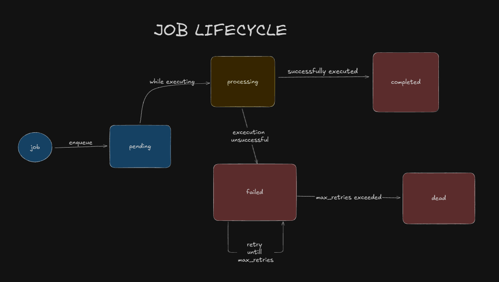

# 🚀 queuectl: A CLI-Based Background Job Queue

`queuectl` is a robust, production-grade background job queue system built entirely in Node.js. It's a command-line application that allows you to enqueue, manage, and process background jobs (like sending emails, processing videos, or running long-running tasks) reliably.

This system is designed for high availability and resilience, featuring persistent storage, automatic retries with exponential backoff, a dead-letter queue for failed jobs, and support for parallel worker processes.

## 💻 Tech Stack

This project uses a modern, lightweight Node.js stack:

* **Core:** **Node.js** (v18+)
* **CLI:** **`yargs`** (for a clean, professional command-line interface)
* **Persistence:** **`sqlite3`** (as a simple, file-based embedded database)
* **Concurrency:** **`worker_threads`** (for true parallel processing of jobs)
* **Web Server:** **`express`** (for the optional monitoring dashboard)
* **CLI Tables:** **`cli-table3`** & **`chalk`** (for "pretty" formatted output)

## 🚀 Setup Instructions

1.  **Clone the Repository:**
    ```bash
    git clone [https://github.com/your-username/queuectl.git](https://github.com/your-username/queuectl.git)
    cd queuectl
    ```

2.  **Install Dependencies:**
    This will install `yargs`, `sqlite3`, `express`, `cors`, `cli-table3`, and all other required packages.
    ```bash
    npm install
    ```

3.  **Make the `queuectl` Command Available:**
    This command "links" your local project to your system, allowing you to use `queuectl` as a global command instead of typing `node cli.js`.
    ```bash
    npm link
    ```

4.  **Run the Full System (Requires 3 Terminals):**
    To run the complete application, you'll need three separate terminals running at the same time.

    * **Terminal 1: Start the Workers**
        This terminal will process the jobs.
        ```bash
        queuectl worker start --count 3
        ```

    * **Terminal 2: Start the Web Dashboard**
        This terminal runs the `express` server.
        ```bash
        node server.js
        ```

    * **Terminal 3: Use the CLI**
        This terminal is for enqueuing jobs and checking status. Start by viewing all available commands.
        ```bash
        queuectl --help
        ```

5.  **View the Dashboard:** execute the ./public/index.html for browser dashboard.

## 💻 Usage Examples (CLI Commands)
All commands are run using the `queuectl` shortcut.
### 1. Getting Help

You can see all available commands and options by running `--help`.

**Command:**
```bash
queuectl --help

Output:

queuectl <command>

Commands:
  queuectl enqueue              Add a new job to the queue
  queuectl worker <action>      Manage worker processes
  queuectl status               Show summary of all job states
  queuectl list                 List jobs. By default, lists ALL jobs. Use
                                --state to filter.
  queuectl dlq <action> [jobId] Manage the Dead Letter Queue
  queuectl config <action>      Manage configuration
  queuectl log <jobId>          View the saved stdout/stderr for a job
  queuectl stats                Show execution stats and metrics

Options:
  --version  Show version number                                       [boolean]
  --help     Show help
```
### 2. Enqueueing Jobs

This is the main command to add new jobs to the queue.

Options:

    --id (Required): A unique ID for the job (e.g., job-101).

    --command (Required): The shell command to run (e.g., "echo 'hello'").

    --priority <num> (Optional): Sets a priority. Higher numbers run first. (Default: 0).

    --delay <seconds> (Optional): Delays the job's execution by N seconds. (Default: 0).

**Command:**

1. simple enqueue :
    ```bash
    queuectl enqueue --id <job-id> --command "<command-string>"
    Output:
    Job enqueued: job-1 (priority: 0)
    ```

2. A high-priority, delayed job :
    ```bash
    queuectl enqueue --id job-3 --command "echo 'I am important'" --priority 10 --delay 30
    Output:
    Job enqueued: job-3 (priority: 10). Will run after 30 seconds.
    ```

### 3. Checking Status

Once you've enqueued jobs, you can monitor their state.

**Command:**
```bash
queuectl status

Output:

Job Status Summary:
┌─────────┬─────────────┬───────┐
│ (index) │ state       │ count │
├─────────┼─────────────┼───────┤
│ 0       │ 'completed' │ 4     │
│ 1       │ 'dead'      │ 1     │
│ 2       │ 'pending'   │ 1     │
└─────────┴─────────────┴───────┘
```
### 4. Listing Jobs

**To see a high-level summary of all jobs:**

Options:

    --state <state-name>

Where <state-name> should be replaced with one of these:

* pending
* processing
* failed
* completed
* dead

**Command :**
 
*  default list command : list all the jobs (in all state)
```bash
queuectl list
Output:
┌────────────────────┬───────────────┬──────────┬────────────────────────────────────────┬──────────────────────────────┐
│ ID                 │ State         │ Attempts │ Command                                │ Updated At                   │
├────────────────────┼───────────────┼──────────┼────────────────────────────────────────┼──────────────────────────────┤
│ job-4              │ pending       │ 0        │ echo 'I am important'                  │ 11/11/2025, 2:20:53 am       │
├────────────────────┼───────────────┼──────────┼────────────────────────────────────────┼──────────────────────────────┤
│ job-2              │ completed     │ 1        │ echo 'Hello World'                     │ 11/11/2025, 2:08:05 am       │
├────────────────────┼───────────────┼──────────┼────────────────────────────────────────┼──────────────────────────────┤
│ job-1              │ completed     │ 1        │ echo 'Hello World'                     │ 11/11/2025, 2:05:49 am       │
├────────────────────┼───────────────┼──────────┼────────────────────────────────────────┼──────────────────────────────┤
│ job-3              │ completed     │ 1        │ echo 'I am important'                  │ 11/11/2025, 2:13:01 am       │
├────────────────────┼───────────────┼──────────┼────────────────────────────────────────┼──────────────────────────────┤
│ job-s4             │ dead          │ 3        │ ping -n 40 127.0.0.1                   │ 11/11/2025, 12:33:29 am      │
├────────────────────┼───────────────┼──────────┼────────────────────────────────────────┼──────────────────────────────┤
│ job-s1             │ completed     │ 1        │ ping -n 2 127.0.0.1                    │ 11/11/2025, 12:34:29 am      │
└────────────────────┴───────────────┴──────────┴────────────────────────────────────────┴──────────────────────────────┘
```
*  To filter the list by a specific state:
```
queuectl list --state completed
Output:
┌────────────────────┬───────────────┬──────────┬────────────────────────────────────────┬──────────────────────────────┐
│ ID                 │ State         │ Attempts │ Command                                │ Updated At                   │
├────────────────────┼───────────────┼──────────┼────────────────────────────────────────┼──────────────────────────────┤
│ job-2              │ completed     │ 1        │ echo 'Hello World'                     │ 11/11/2025, 2:08:05 am       │
├────────────────────┼───────────────┼──────────┼────────────────────────────────────────┼──────────────────────────────┤
│ job-1              │ completed     │ 1        │ echo 'Hello World'                     │ 11/11/2025, 2:05:49 am       │
├────────────────────┼───────────────┼──────────┼────────────────────────────────────────┼──────────────────────────────┤
│ job-3              │ completed     │ 1        │ echo 'I am important'                  │ 11/11/2025, 2:13:01 am       │
├────────────────────┼───────────────┼──────────┼────────────────────────────────────────┼──────────────────────────────┤
│ job-s1             │ completed     │ 1        │ ping -n 2 127.0.0.1                    │ 11/11/2025, 12:34:29 am      │
└────────────────────┴───────────────┴──────────┴────────────────────────────────────────┴──────────────────────────────┘
```
### 5. Running Workers

These commands start and stop the worker "engine." The workers are the processes that run your jobs.

**To start one or more parallel workers:**

**Command:**

* default command will start one worker
```bash
queuectl worker start
Output:
Starting 1 worker(s)...
1 worker(s) started.
[worker-1] Starting...
```
* below command will start more than one worker , worker-count define the number of worker
```
queuectl worker start --count <worker-count>
Output:
Starting 3 worker(s)...
3 worker(s) started.
[worker-3] Starting...
[worker-2] Starting...
[worker-1] Starting...
```
### 6. Managing the Dead Letter Queue (DLQ)

When a job fails all of its retry attempts, it is moved to the `dead` state, also known as the Dead Letter Queue (DLQ). These commands allow you to view and manage these permanently failed jobs.

**To list all jobs in the DLQ:**

**Command:**
```bash
queuectl dlq list
Output:
┌─────────┬──────────┬────────────────────────┬────────┬──────────┬────────────────────────────┐
│ (index) │ id       │ command                │ state  │ attempts │ updated_at                 │
├─────────┼──────────┼────────────────────────┼────────┼──────────┼────────────────────────────┤
│ 0       │ 'job-s4' │ 'ping -n 40 127.0.0.1' │ 'dead' │ 3        │ '2025-11-10T19:05:34.189Z' │
└─────────┴──────────┴────────────────────────┴────────┴──────────┴────────────────────────────┘
```
* **To retry a specific job from the DLQ:** This command resets the job's attempts and moves it back to the pending state to be run again.

```
queuectl dlq retry <job-id>
```
### 7. Viewing Logs & Stats

You can inspect the output of a finished job or see high-level metrics for the whole system.

**To view the saved output (stdout/stderr) for a specific job:**

**Command:**
```bash
queuectl log <jobId>
```
```
 queuectl log job-4 
 Output:
 ---------------------------------
Logs for Job: job-4
State: completed
---------------------------------

--- STDOUT ---
'I am important'

--- STDERR ---
(empty)

---------------------------------
```
* To show average job duration and other metrics:
```
queuectl stats

output:
--- QueueCTL Metrics ---

Job Counts:
  - completed: 5
  - dead: 1

Execution Stats:
  - Avg. Job Duration (Completed): 0.26 seconds
```

### 8. Managing Configuration

You can view and change the queue's settings live, without restarting the workers.

To list all current settings:
```
queuectl config list

Output:
┌─────────┬────────────────┬───────┐
│ (index) │ key            │ value │
├─────────┼────────────────┼───────┤
│ 0       │ 'max_retries'  │ '3'   │
│ 1       │ 'backoff_base' │ '2'   │
└─────────┴────────────────┴───────┘
```
**To change a setting (e.g., make backoff delays longer):**
```
queuectl config set backoff_base <number>
```

## 🏛️ Architecture Overview

This project is built on a "separation of concerns" model, where each part of the system has one clear responsibility.


1.  **`cli.js` (The Interface):** Powered by `yargs`, this is the "control panel." It parses user commands (like `enqueue`) and writes jobs to the database.
2.  **`worker.js` (The Engine):** This is the core logic. It runs as a separate, parallel process. It polls the database, executes jobs, and handles all failures, retries, and timeouts.
3.  **`db.js` (The Data Layer):** This manages the **SQLite** (`queue.db`) file. It is the central "source of truth" that both the CLI and the workers read from and write to.
4.  **`server.js` (The Dashboard):** An `express` server that runs in parallel, providing a read-only API and web dashboard for monitoring.

---

### Job Lifecycle


A job moves through several states, all of which are tracked in the database, matching the assignment's requirements.


1.  **`pending`**: The job is new and waiting. If it's a *scheduled* job (using `--delay`), it stays `pending` until its `run_at` time has passed.
2.  **`processing`**: A worker has locked the job and is currently executing it.
3.  **`failed`**: The job's command failed (non-zero exit code or timeout) but it still has retries left. It waits for its exponential backoff delay (`run_at`) to pass before being picked up again.
4.  **`completed`**: The job's command finished with an exit code of 0.
5.  **`dead`**: The job has exhausted all `max_retries` and is moved to the Dead Letter Queue.


---

### Concurrency, Persistence, & Recovery

* **Persistence:** All job and config data is stored in the `queue.db` file. This means if you restart the program, no jobs are lost.

* **Concurrency Lock:** To prevent two workers from grabbing the same job (a "race condition"), the worker uses a `BEGIN IMMEDIATE TRANSACTION;` SQL command. This acts as an **exclusive lock on the database**, forcing workers to pick jobs one at a time. This guarantees a job is only processed once.
    

* **Stale Job Recovery:** To handle worker crashes, the `pollAndLockJob` query is "stale-aware." It can "rescue" any job that has been in the `processing` state for more than 10 seconds (our "lease" time), marking it as `failed` so it can be safely retried.

### Worker Logic (The Engine)

The `worker.js` file is the "engine" of the queue. It runs in a continuous loop, and its job is to find and execute tasks.


The loop consists of three main phases:

1.  **Poll & Lock:**
    The worker queries the database to find the *highest priority* job that is ready to run. The query is "stale-aware" and looks for a job that is:
    * **`pending`** (and its `run_at` time is in the past), **OR**
    * **`failed`** (and its `run_at` backoff time has expired), **OR**
    * **`processing`** (but has been "stuck" for more than 10 seconds, indicating a worker crashed).
    
    To prevent two workers from grabbing the same job, it uses `BEGIN IMMEDIATE TRANSACTION;` to get an exclusive lock on the database while it "picks" its job.

2.  **Execute:**
    The worker runs the job's command using Node.js's `child_process.exec` inside a `try...catch` block.
    * **Success:** If the command exits with code 0, the `try` block succeeds.
    * **Failure:** If the command exits with a non-zero code (like `exit 1`), or if it hits the 30-second **timeout**, `exec` throws an error and the code jumps to the `catch` block.

3.  **Update & Repeat:**
    * **On Success:** The job's state is set to `completed`, `attempts` is set to 1, and the `stdout` is saved to the database.
    * **On Failure:** The worker checks the `attempts` count.
        * If `attempts < max_retries`, it calculates the exponential backoff (e.g., $5^{attempts}$ seconds), sets the state to `failed`, and sets the `run_at` to that future time.
        * If `attempts >= max_retries`, it sets the state to `dead` and moves it to the DLQ.

The worker also checks for a `.stopfile` on each loop, allowing it to shut down gracefully after finishing its current job.

## 🤔 Assumptions & Trade-offs

This project was built with simplicity, robustness, and the assignment's requirements in mind.

* **SQLite vs. Postgres/Redis:** SQLite was chosen because it's a simple, file-based "embedded DB" that requires zero configuration. It handles all necessary locking for this project perfectly. For a massive, high-throughput system (thousands of jobs per second), a dedicated database server like **Postgres** (for row-level locking) or **Redis** (for high-speed in-memory queuing) would be a better choice to reduce disk I/O.

* **`worker_threads` vs. `cluster`:** `worker_threads` was used for parallel processing. It's more lightweight and memory-efficient than spinning up full OS processes with the `cluster` module, which is ideal for I/O-bound tasks like running shell commands.

* **Locking Strategy:** The system uses a `BEGIN IMMEDIATE TRANSACTION` to get an *exclusive lock* on the entire database file for the few milliseconds it takes to pick a job. This is extremely simple and 100% safe. The trade-off is that it doesn't allow multiple workers to *pick* jobs at the same time (though they can *execute* them in parallel).

* **Graceful Shutdown:** The `queuectl worker stop` command uses a `.stopfile` on disk to signal workers. This is a simple and effective way to communicate across separate processes. A more advanced system might use a dedicated inter-process communication (IPC) channel or OS signals (like `SIGINT`).

## 🧪 Testing Instructions (Verification Flow)

This guide will walk you through testing every feature of the `queuectl` system.

### 1. Setup Your Terminals

You will need **4 separate terminals** open for this test flow:

* **Terminal 1 (Worker):** Run `queuectl worker start`
* **Terminal 2 (Worker):** Run `queuectl worker start`
* **Terminal 3 (Web Server):** Run `node server.js`
* **Terminal 4 (CLI):** This is where you will type all the following commands.

Open public/index.html to watch the dashboard update live.

---

### Test Flow 1: The "Happy Path" (Success & Logging)

This test validates that a simple job can be enqueued, executed, and logged.

1.  **Enqueue a successful job:**
    ```bash
    queuectl enqueue --id job-success --command "echo 'This job worked'"
    ```
2.  **Observe:** Watch one of your worker terminals (`Terminal 1` or `2`). You will see it start and finish the job.
    ```
    [worker-1] --- STARTING Job: job-success (Attempt 1 of 3) ---
    [worker-1]   -> Command: echo 'This job worked'
    [worker-1]   -> Status: SUCCESS
    [worker-1]   -> stdout: 'This job worked'
    [worker-1] --- FINISHED Job: job-success ---
    ```
3.  **Check the `completed` list:**
    ```bash
    queuectl list --state completed
    ```
4.  **Check the logs:**
    ```bash
    queuectl log job-success
    ```
    *(You will see the saved `stdout` "This job worked")*

---

### Test Flow 2: Failure, Retry, Backoff, and DLQ

This test validates the *entire* failure lifecycle.

1.  **Enqueue a job that will fail:**
    ```bash
    queuectl enqueue --id job-fail --command "this-command-does-not-exist"
    ```
2.  **Observe:** Watch a worker terminal. It will try the job and fail.
    ```
    [worker-2] --- STARTING Job: job-fail (Attempt 1 of 3) ---
    [worker-2]   -> Status: FAILED
    [worker-2]   -> stderr: 'this-command-does-not-exist' is not...
    [worker-2]   -> ACTION: Retrying. Next run at 2025-11-11T12:30:02Z
    [worker-2] --- FINISHED Job: job-fail ---
    ```
3.  **Check the `failed` state:** While the job is in its backoff period, check the `failed` list.
    ```bash
    queuectl list --state failed
    ```
4.  **Observe:** The worker will try two more times, with longer delays (exponential backoff). After the 3rd failure, it will log:
    ```
    [worker-2]   -> ACTION: Moving to DLQ (Max retries reached).
    ```
5.  **Check the DLQ:**
    ```bash
    queuectl dlq list
    ```
6.  **Retry the job:**
    ```bash
    queuectl dlq retry job-fail
    ```
    *(The worker will now pick it up and repeat the failure process).*

---

### Test Flow 3: Concurrency & Priority

This test proves multiple workers run in parallel and respect priority.

1.  **Enqueue two low-priority "sleep" jobs:**
    ```bash
    queuectl enqueue --id job-low-1 --command "ping -n 6 127.0.0.1" --priority 1
    queuectl enqueue --id job-low-2 --command "ping -n 6 127.0.0.1" --priority 1
    ```
2.  **Observe:** Your two worker terminals (`T1` & `T2`) will *both* start working at the same time.
3.  **Enqueue a high-priority job:** *While the first two are running*, enqueue a high-priority job.
    ```bash
    queuectl enqueue --id job-high --command "echo 'I AM HIGH PRIORITY'" --priority 100
    ```
4.  **Observe:** As soon as one worker finishes its "sleep" job, it will **immediately** run `job-high` next, proving the priority queue works.

---

### Test Flow 4: Config, Scheduling, and Timeout

This test validates the bonus features.

1.  **Change Config:** Make the backoff delay very long (10 seconds).
    ```bash
    queuectl config set backoff_base 10
    ```
2.  **Test Delay:** Enqueue a job with a 10-second delay.
    ```bash
    queuectl enqueue --id job-delayed --command "echo 'I am 10s late'" --delay 10
    ```
    *Observe:* Your workers will do nothing for 10 seconds, and *then* one will pick up and run the job.

3.  **Test Timeout:** Enqueue a job that takes 40 seconds (longer than the 30s timeout).
    ```bash
    queuectl enqueue --id job-timeout --command "ping -n 40 127.0.0.1"
    ```
    *Observe:* A worker will start the job, run for 30 seconds, then log `Status: FAILED` and `stderr: Command failed...`. This proves the timeout works.

---

### Test Flow 5: Persistence & Stale Job Recovery

This test proves your system can survive a worker crash.

1.  **Enqueue a long-running job:**
    ```bash
    queuectl enqueue --id job-long --command "ping -n 40 127.0.0.1"
    ```
2.  **Observe:** Wait for a worker (e.g., in `Terminal 1`) to start the job.
    `[worker-1] --- STARTING Job: job-long ...`
3.  **Crash the worker:** Press **`Ctrl+C`** in `Terminal 1`.
4.  **Check the state:** The job is now "stuck."
    ```bash
    queuectl list --state processing
    ```
5.  **Restart the worker:** In `Terminal 1`, restart the worker.
    ```bash
    queuectl worker start
    ```
6.  **Observe:** After 10 seconds (your "lease" time), the worker will automatically rescue the job.
    `[worker-1] Rescuing stale job: job-long (was locked by worker-1)`
    *(It will then restart the job, which will fail from the timeout, proving all systems work together).*